# Secure AI Knowledge Hub (SAKH)

An enterprise-oriented secure AI knowledge management platform that enables organizations to store, process, search, and retrieve internal documents using Retrieval-Augmented Generation (RAG) with Role-Based Access Control (RBAC).

The backend API is deployed on Render, the React frontend is served by Vercel, and the database is hosted on Neon PostgreSQL with pgvector for vector similarity search. AI capabilities are powered by Google Gemini.

---

## Overview

SAKH solves a common enterprise problem: internal knowledge is scattered across documents, emails, and file shares, making it difficult for employees to find relevant information quickly. The platform ingests documents (PDF, DOCX), extracts text, generates embeddings, and indexes everything for semantic search. Users ask natural language questions and receive AI-generated answers with citations sourced exclusively from documents they are authorized to access.

Access control is enforced at every layer: authentication, API endpoints, document retrieval, and RAG answer generation. A user in one department cannot see documents from another department, and AI responses only include content from permitted sources.

---

## Key Features

- **JWT Authentication** — stateless token-based auth with configurable expiry
- **Role-Based Access Control (RBAC)** — ADMIN, MANAGER, EMPLOYEE, GUEST roles with hierarchical permissions
- **Department-Based Access** — documents are scoped to departments; users access only their department's documents (ADMIN sees all)
- **User Management** — admin-only user registration, status toggling, role assignment
- **Department Management** — admin-only CRUD for organizational departments
- **Document Upload & Processing** — supports PDF, DOCX; async text extraction, chunking, embedding generation
- **Versioning** — document re-upload creates new versions while preserving history
- **Vector Search** — pgvector-based cosine similarity search across embedded document chunks
- **Hybrid Search** — combines semantic (vector) and keyword (BM25-style) search with reciprocal rank fusion
- **Retrieval-Augmented Generation** — multi-query expansion, query rewriting, context-aware prompting, answer grounding
- **Hallucination Mitigation** — sentence-level verification against source documents
- **Source Citations** — each answer cites specific document chunks with similarity scores
- **Chat Sessions** — persistent conversation history, automatic summarization at scale, title generation
- **Activity Logging** — audit trail for logins, uploads, queries, and admin actions
- **Dashboard Metrics** — document counts, query volumes, recent activity, retrieval effectiveness
- **OpenAPI Documentation** — Swagger UI at `/api/swagger-ui.html`
- **Docker Support** — multi-stage Dockerfiles for backend and frontend, docker-compose for local development
- **Production Deployment** — configured for Render (backend) + Vercel (frontend) + Neon PostgreSQL

---

## Tech Stack

| Layer | Technology | Version |
|---|---|---|
| **Frontend** | React | 19 |
| | Vite | 6 |
| | Material UI | 7 |
| | React Router | 7 |
| | Axios | 1 |
| **Backend** | Java | 21 |
| | Spring Boot | 3.5 |
| | Spring Security | 6 |
| | Spring Data JPA | 3 |
| | Spring AI | 1.1 |
| | JWT (jjwt) | 0.12 |
| | Flyway | 10 |
| **Database** | PostgreSQL | 17 |
| | pgvector | 0.8 |
| **AI** | Google Gemini | 2.5 Flash (chat) / text-embedding-004 (embeddings) |
| **Deployment** | Docker | multi-stage builds |
| | Render | backend API |
| | Vercel | frontend SPA |
| | Neon | PostgreSQL + pgvector |

---

## System Architecture

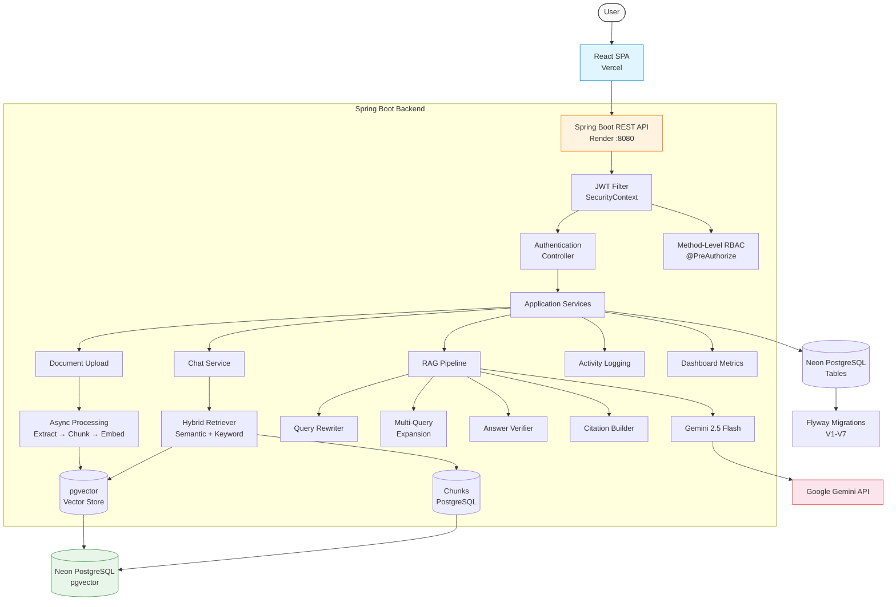

---

## RAG Pipeline

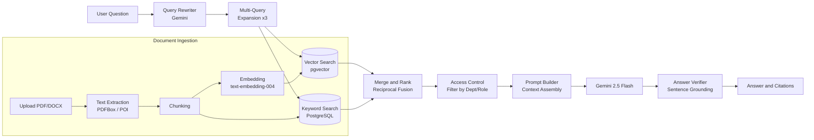

---

## Security Architecture

- **Authentication**: JWT tokens issued at login, validated on every request by `JwtAuthenticationFilter`
- **Password Hashing**: BCrypt via Spring Security `PasswordEncoder`
- **Authorization**: Method-level `@PreAuthorize` annotations + request-matcher rules in `SecurityConfig`
- **Role Hierarchy**: ADMIN > MANAGER > EMPLOYEE > GUEST
- **Document Access**: Vector search and keyword search filter results by department ID and role — ADMIN sees all, MANAGER sees department, EMPLOYEE sees department + own uploads
- **CORS**: Configurable via `CORS_ALLOWED_ORIGINS` env var; supports multiple origins
- **Secrets**: All credentials are injected via environment variables — no hardcoded production secrets in source code
- **Frontend**: Route-level guards exist for UX but serve no security purpose; all authorization is enforced server-side

---

## Roles and Permissions

| Role | Description | Documents | Users | Departments | Activity Logs | Chat |
|---|---|---|---|---|---|---|
| ADMIN | Full system access | All documents | View, create, toggle status | CRUD | View all | All docs |
| MANAGER | Department management | Department documents | View department users | View only | Department scope | Department docs |
| EMPLOYEE | Document interaction | Own uploads + department docs | View own profile | View only | Own activity | Department docs + own uploads |
| GUEST | Read-only access | Only explicitly uploaded | View own profile | View only | Own activity | Own uploads only |

---

## Project Structure

```
Secure-AI-Knowledge-Hub/
├── backend/
│   ├── src/main/java/com/sakh/
│   │   ├── config/            # Swagger configuration
│   │   ├── controller/        # REST controllers (9)
│   │   ├── dto/               # Request/response DTOs
│   │   ├── entity/            # JPA entities (9)
│   │   ├── enums/             # ActivityType, DocumentStatus, UserStatus
│   │   ├── exception/         # Global exception handler
│   │   ├── llm/               # LLM service (Gemini wrapper)
│   │   ├── processing/        # Document processing pipeline
│   │   │   └── parser/        # PDF, DOCX parsers
│   │   ├── rag/               # RAG pipeline (7 components)
│   │   ├── repository/        # Spring Data JPA repositories (9)
│   │   ├── security/          # JWT, CORS, auth filter, security config
│   │   ├── service/           # Business services (10)
│   │   ├── storage/           # Local file storage
│   │   └── validation/        # Validation constants
│   ├── src/main/resources/
│   │   ├── db/migration/      # Flyway migrations (V1-V7)
│   │   ├── application.yml    # Main config (env var placeholders)
│   │   └── application-prod.yml
│   ├── Dockerfile
│   └── pom.xml
├── frontend/
│   ├── src/
│   │   ├── components/        # Layout, common components
│   │   ├── context/           # Auth context
│   │   ├── pages/             # Route pages (9)
│   │   ├── routes/            # React Router config
│   │   ├── services/          # Axios API services (7)
│   │   └── theme.js           # MUI theme
│   ├── Dockerfile
│   ├── nginx.conf
│   └── vercel.json
├── docker/
│   ├── docker-compose.yml     # Local development
│   ├── docker-compose.supabase.yml
│   └── docker-compose.neon.yml
├── docs/
│   ├── ARCHITECTURE.md
│   ├── DEPLOYMENT.md
│   ├── SECURITY.md
│   └── screenshots/           # Application screenshots
├── .gitignore
├── LICENSE
└── README.md
```

---

## Local Development

### Prerequisites

- Java 21
- Node.js 22
- Docker Desktop
- Gemini API key (free tier)

### 1. Clone and Configure

```sh
git clone https://github.com/vedantkerkar68-blip/Secure-AI-Knowledge-Hub.git
cd Secure-AI-Knowledge-Hub
```

Copy the environment template:

```sh
cp backend/.env.example backend/.env
```

Edit `backend/.env` and set `GEMINI_API_KEY`.

### 2. Start with Docker (recommended)

```sh
docker compose up -d
```

This starts PostgreSQL (pgvector), the backend, and the frontend. Access:
- Frontend: http://localhost:3000
- Backend API: http://localhost:8080/api
- Swagger UI: http://localhost:8080/api/swagger-ui.html
- Health: http://localhost:8080/api/health

### 3. Or Run Without Docker

Start PostgreSQL with pgvector (Docker):

```sh
docker run -d --name sakh-pg -e POSTGRES_USER=postgres -e POSTGRES_PASSWORD=root -e POSTGRES_DB=sakh_db -p 5432:5432 pgvector/pgvector:pg17
```

Start backend:

```sh
cd backend
mvn spring-boot:run
```

Start frontend (new terminal):

```sh
cd frontend
npm install
npm run dev
```

### Demo Credentials

| Email | Password | Role |
|---|---|---|
| admin@sakh.com | Admin@123 | ADMIN |

ADMIN users can register additional users through the Users page.

---

## Environment Variables

### Backend (`backend/.env` or Render env vars)

| Variable | Description | Local Default |
|---|---|---|
| `SPRING_DATASOURCE_URL` | PostgreSQL JDBC URL | `jdbc:postgresql://localhost:5432/sakh_db` |
| `SPRING_DATASOURCE_USERNAME` | Database user | `postgres` |
| `SPRING_DATASOURCE_PASSWORD` | Database password | `root` |
| `JWT_SECRET` | 256+ bit secret for JWT signing | `9a8b7c6d...` (dev only) |
| `GEMINI_API_KEY` | Google Gemini API key | *(required)* |
| `APP_STORAGE_UPLOAD_DIR` | File upload directory | `./storage/uploads` |
| `CORS_ALLOWED_ORIGINS` | Allowed CORS origins | `http://localhost:3000,http://localhost:5173` |

### Frontend (`frontend/.env` or Vercel env vars)

| Variable | Description | Local Default |
|---|---|---|
| `VITE_API_BASE_URL` | Backend API base URL | `http://localhost:8080/api` |

> **Security**: Never expose database credentials, Gemini API keys, or JWT secrets in frontend environment variables. They are server-side only.

---

## Docker

The project includes multi-stage Dockerfiles for optimized builds. Pre-built images are available on Docker Hub:

- `vedantkerkar/sakh-backend:latest`
- `vedantkerkar/sakh-frontend:latest`

```sh
# Build and run locally
docker compose up -d

# Rebuild images
docker compose build

# View logs
docker compose logs -f backend

# Pull pre-built images
docker compose pull

# Stop
docker compose down
```

### Alternative Database Backends

```sh
# Use Neon PostgreSQL instead of local
docker compose -f docker/docker-compose.neon.yml up -d

# Use Supabase PostgreSQL instead of local
docker compose -f docker/docker-compose.supabase.yml up -d
```

---

## Production Deployment

| Component | Platform | Configuration |
|---|---|---|
| **Frontend** | Vercel | Set `VITE_API_BASE_URL` to `https://secure-ai-knowledge-hub.onrender.com/api` |
| **Backend** | Render | Set all backend env vars; health check at `/api/health` |
| **Database** | Neon PostgreSQL | pgvector extension enabled; SSL required |
| **AI** | Google Gemini API | Free tier API key |

---

## API Documentation

Swagger UI is available when the backend is running:

- **Local**: http://localhost:8080/api/swagger-ui.html
- **Production**: https://secure-ai-knowledge-hub.onrender.com/api/swagger-ui.html

OpenAPI spec at `/api/v3/api-docs`.

---

## Screenshots

| | | |
|---|---|---|
| [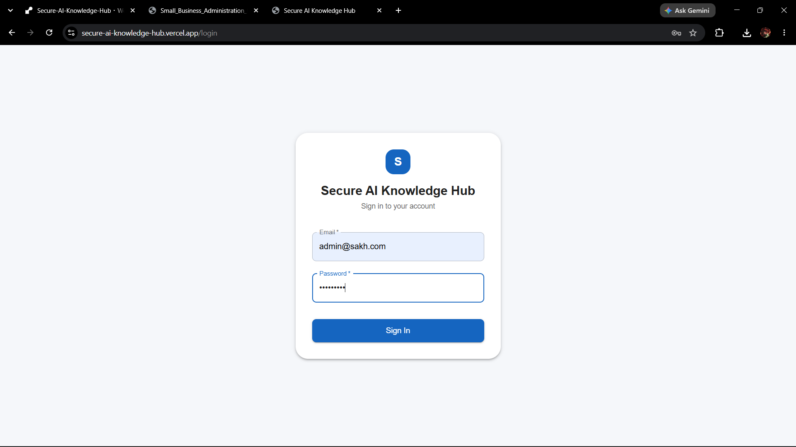](docs/screenshots/01-login.png) | [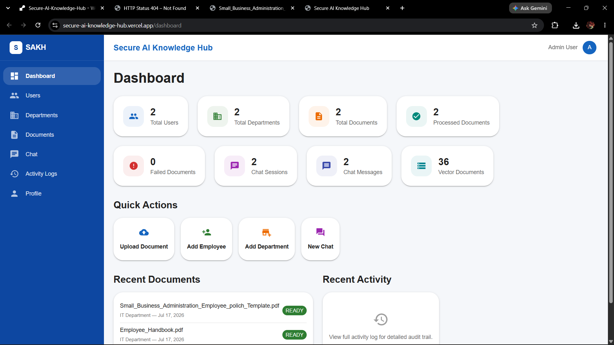](docs/screenshots/02-admin-dashboard.png) | [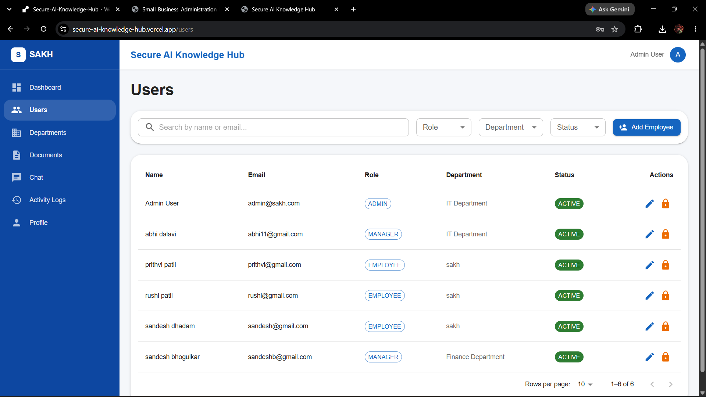](docs/screenshots/03-users.png) |
| **Login** | **Admin Dashboard** | **User Management** |
| [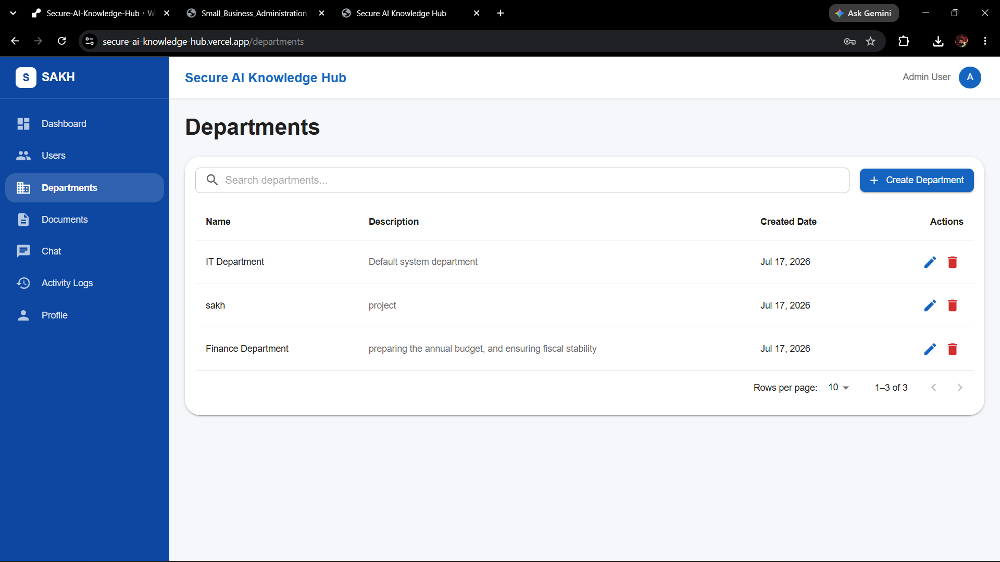](docs/screenshots/04-departments.png) | [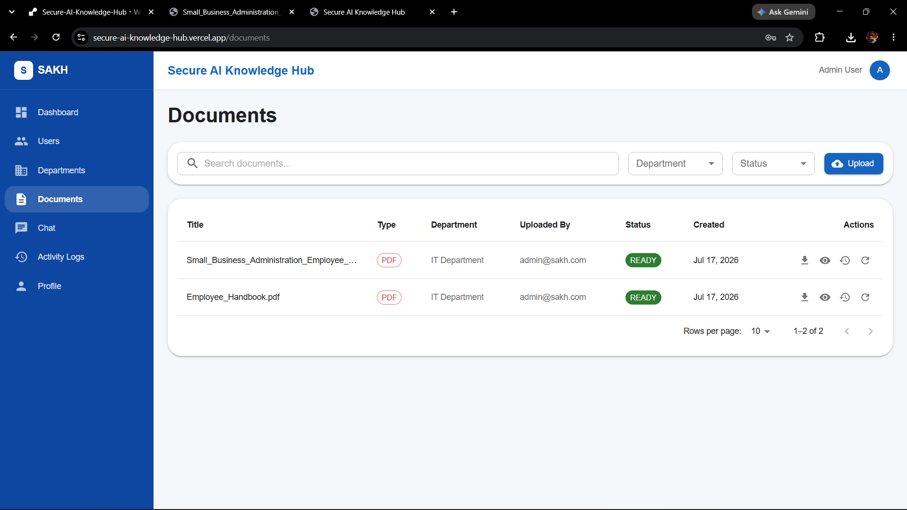](docs/screenshots/05-documents.png) | [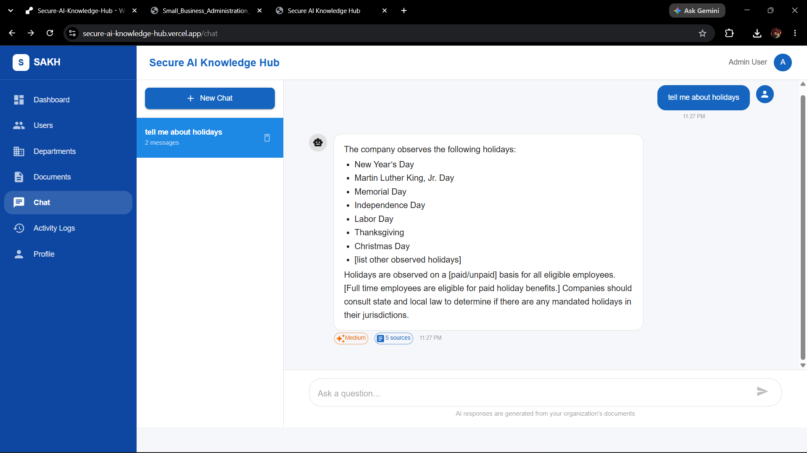](docs/screenshots/06-ai-chat.png) |
| **Departments** | **Document Management** | **AI Chat** |
| [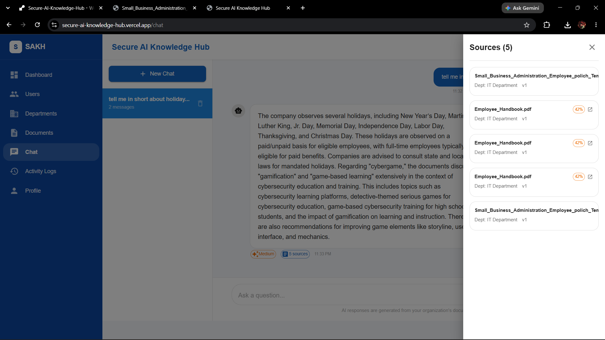](docs/screenshots/07-rag-sources.png) | [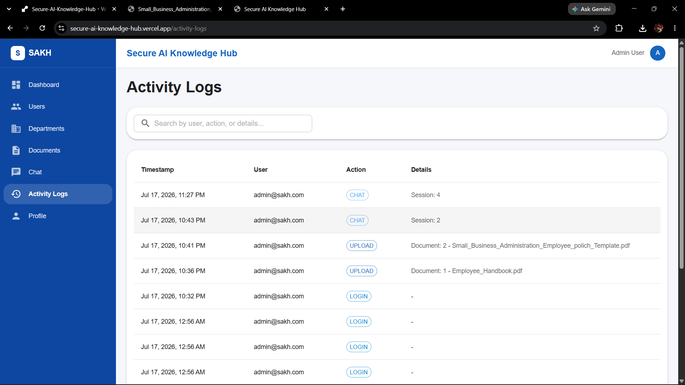](docs/screenshots/08-activity-logs.png) | [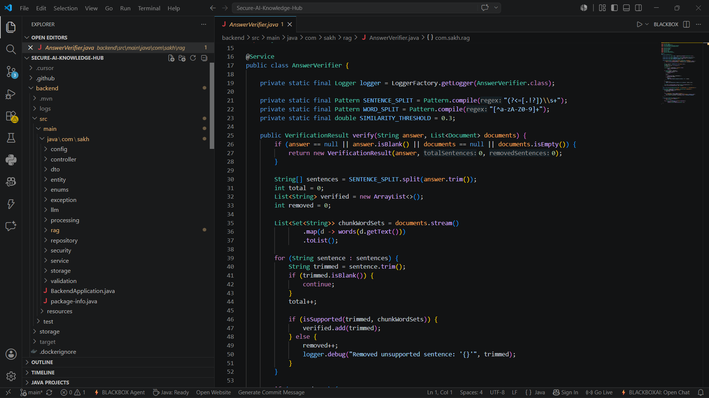](docs/screenshots/09-codebase.png) |
| **RAG Sources** | **Activity Logs** | **Codebase Structure** |
| [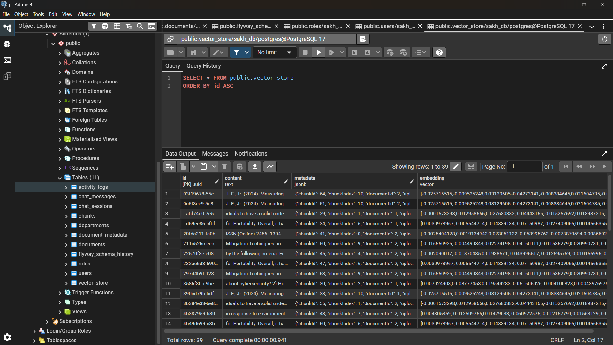](docs/screenshots/10-database.png) | | |
| **Database Schema** | | |

---

## Future Improvements

- Persistent object storage (AWS S3 / MinIO) for uploaded documents
- Redis caching for vector search results and session state
- Asynchronous document processing with progress tracking
- Streaming AI responses for real-time UX
- Prometheus/Grafana observability
- CI/CD pipeline with automated integration tests
- Rate limiting on chat endpoints
- Production-grade monitoring and alerting

---

## License

MIT License. See [LICENSE](LICENSE) for details.
